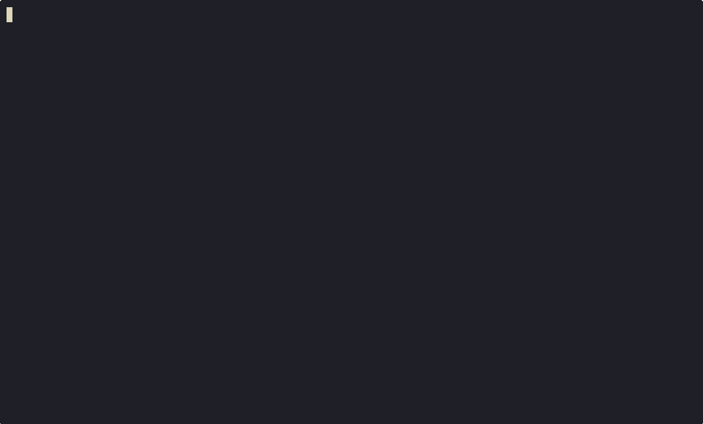

<div align="center">

# `csf`

### Claude Session Finder

browse &nbsp;·&nbsp; search &nbsp;·&nbsp; resume

[](LICENSE)
[](README.md)
[](https://github.com/junegunn/fzf)

An interactive terminal browser for your [Claude Code](https://claude.ai/code) sessions —
fuzzy search, rich previews, one-key resume, and auto-generated AI summaries.  Just a tool to find the session you're looking for, renders them all from your local session storage, launches it with `claude --resume [SESSION_ID]`




</div>

---

## Features

```
  ⚡  Instant fuzzy search  — titles, projects, and full message content
  🔍  Rich session previews — summary, duration, project, conversation snippets
  ↩   One-key resume       — Enter jumps straight into claude --resume
  ✨  Auto-summarize        — extractive NLP summaries, no model download
  🗂   CLI filter modes      — --today, --week, --projects, --stats
  🗑   Session management   — delete, export to Markdown, copy ID
```

---

## Install

```bash
brew tap krisbradley/tap
brew install claude-session-finder
```

The formula installs all dependencies automatically:

| Dependency | Purpose |
|-----------|---------|
| `fzf` | Interactive fuzzy finder UI |
| `python3` | Helper scripts |
| `sumy` + `numpy` + `nltk` | Extractive AI summarization (isolated venv) |

> **Note:** `nltk` downloads ~13 MB of tokenizer data on the first run of `csf-summarize`.

> **macOS only.** `ctrl-y` uses `pbcopy` and `ctrl-p` uses `open`. Linux would need `xclip`/`xdg-open`.

---

## Setup: Auto-Summarize Hook

After installing, add a Stop hook so Claude Code automatically summarizes each session when it ends:

```json
// ~/.claude/settings.json
{
  "hooks": {
    "Stop": [
      {
        "matcher": "",
        "hooks": [{ "type": "command", "command": "csf-hook" }]
      }
    ]
  }
}
```

`csf-summarize` runs silently in the background after each session and caches results in `~/.claude/csf-summaries.json`.

---

## Usage

### Interactive browser

```bash
csf
```

| Key | Action |
|-----|--------|
| Type | Full-text search across titles, projects, and messages |
| `↑` / `↓` | Navigate sessions |
| `Enter` | Resume session with `claude --resume` |
| `ctrl-d` | Delete session from history |
| `ctrl-y` | Copy session ID to clipboard |
| `ctrl-e` | Export session to Markdown on Desktop |
| `ctrl-p` | Open project folder in Finder |
| `ESC` | Exit |

### Filter modes

```bash
csf --stats       # total sessions, activity this week, top projects
csf --projects    # browse sessions grouped by project
csf --today       # sessions from today only
csf --week        # sessions from the past 7 days
```

### Summarization

```bash
csf-summarize        # summarize new or changed sessions
csf-summarize --all  # regenerate all summaries from scratch
```

---

## How It Works

### Session data

Claude Code appends a line to `~/.claude/history.jsonl` after each message:

```json
{
  "sessionId": "abc123",
  "timestamp": 1711234567890,
  "project": "/Users/you/dev/my-app",
  "display": "first message text"
}
```

`csf` groups entries by `sessionId`, ranks by recency, and generates a title from the first few messages using keyword extraction and filler-phrase stripping.

### Full-text search

`csf` builds a TSV index at `~/.claude/csf-sessions.tsv` containing the full content of every session. When you type, fzf reloads results via `change:reload(csf-search {q})` — so search reaches every word in every message, not just titles.

### AI summaries

`csf-summarize` uses [sumy](https://github.com/miso-belica/sumy) with the LSA algorithm — extractive summarization, no model download, no API, no GPU. It prefers full transcripts from `~/.claude/debug/` when available, and falls back to `history.jsonl` display messages.

### File layout

```
~/.claude/
├── history.jsonl         ← written by Claude Code
├── csf-sessions.tsv      ← full-text search index (built by csf)
├── csf-summaries.json    ← cached summaries (built by csf-summarize)
└── debug/
    └── <session-id>.txt  ← full transcripts (written by Claude, if enabled)
```

---

## Keybinding Reference

| Key | Script | What it does |
|-----|--------|-------------|
| `Enter` | `csf` | `claude --resume <session-id>` |
| `ctrl-d` | `csf-delete` | Remove from history, summaries, and search index |
| `ctrl-y` | inline | `echo <id> \| pbcopy` |
| `ctrl-e` | `csf-export` | Write Markdown to `~/Desktop/` and open |
| `ctrl-p` | inline | `open <project-path>` in Finder |

---

## Manual Install (Development)

```bash
git clone https://github.com/kristopherbradley/claude-session-finder
cd claude-session-finder

# Copy scripts to ~/.local/bin
mkdir -p ~/.local/bin
cp csf ~/.local/bin/csf && chmod +x ~/.local/bin/csf

for script in scripts/csf-delete scripts/csf-export scripts/csf-search scripts/csf-preview scripts/csf-hook; do
  cp "$script" ~/.local/bin/ && chmod +x ~/.local/bin/"$(basename $script)"
done

# Create a venv and install summarization deps
python3 -m venv ~/.local/share/csf-venv
~/.local/share/csf-venv/bin/pip install sumy numpy

# Write a wrapper so csf-summarize uses the venv python
REPO_DIR="$(pwd)"
cat > ~/.local/bin/csf-summarize <<EOF
#!/bin/bash
exec "\$HOME/.local/share/csf-venv/bin/python3" "$REPO_DIR/scripts/csf-summarize" "\$@"
EOF
chmod +x ~/.local/bin/csf-summarize

# Add ~/.local/bin to your PATH if needed
echo 'export PATH="$HOME/.local/bin:$PATH"' >> ~/.zshrc
```

---

<div align="center">

MIT License · built for [Claude Code](https://claude.ai/code)

</div>
